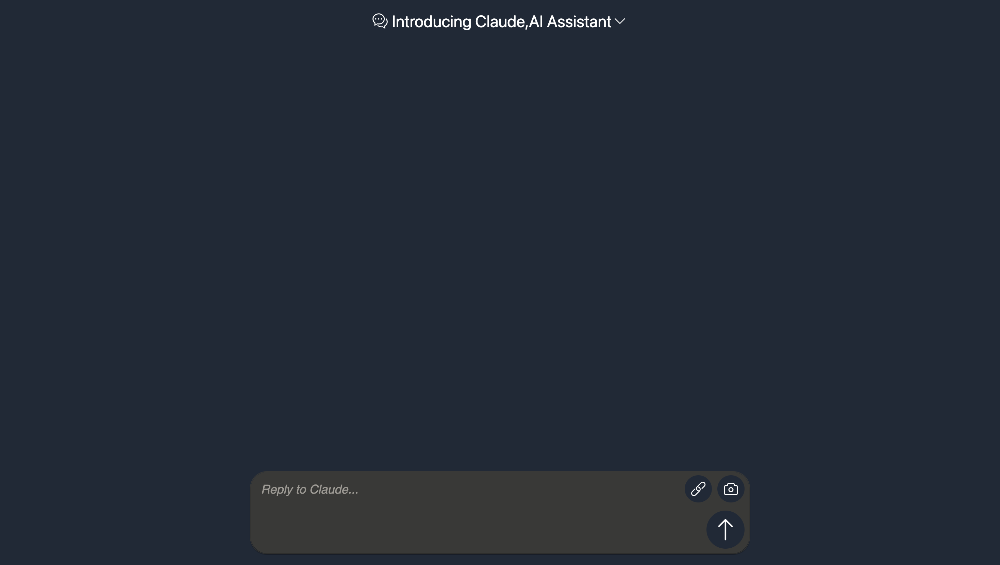

# 使用Rspack重构的一个版本

## 介绍

这是一个使用Rspack重构的版本，使用tailwindcss重写样式
计划配置环境变量实现个人token配置

## Setup （切换分支后记得重新安装依赖哦）

Install the dependencies:

```bash
pnpm install
```

## Get Started

Start the dev server:

```bash
pnpm dev
```

Build the app for production:

```bash
pnpm build
```

Preview the production build locally:

```bash
pnpm preview
```


